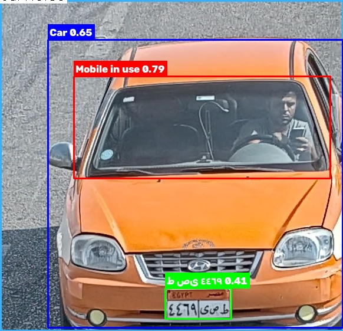

# Vehicle Compliance Monitoring System

Real-time vehicle compliance monitoring — seatbelt use, mobile phone use, and license plate recognition — using a four-model pipeline with YOLO11, BotSort tracking, and SQLite logging.



## Overview

The system watches a live feed, detects vehicles, and tracks each one with BotSort. For every tracked vehicle, three specialized models run on the cropped vehicle region: one checks seatbelt use, one checks for mobile phone use, and one locates the license plate, which is then read with EasyOCR. Once a plate number is successfully read, the full record for that vehicle is logged to SQLite.

| Class (Vehicle model — pretrained COCO) | Label |
|-------------------------------------------|-------|
| 2 | Car |
| 7 | Truck |

| Class (Seatbelt model) | Label |
|--------------------------|-------|
| 0 | No Seatbelt |
| 1 | Seatbelt |

| Class (Mobile model) | Label |
|------------------------|-------|
| 0 | Mobile phone in use |

| Class (Plate model) | Label |
|------------------------|-------|
| 0 | License plate |

## Features

- Four-model pipeline: vehicle detection, seatbelt classification, mobile phone detection, and plate detection, each purpose-built for its task
- BotSort tracking, chosen over ByteTrack for stronger tracking performance in this pipeline
- Seatbelt, mobile, and plate models all run on the cropped vehicle region rather than the full frame, to save inference time
- License plate text extracted with EasyOCR, read once per tracked vehicle and cached to avoid repeat OCR calls
- SQLite event logging — vehicle type, seatbelt status, mobile phone status, plate number, and timestamp
- A vehicle is only logged once its plate number has been successfully read
- Detections below 0.4 confidence are filtered out

## Model Evaluation

### Seatbelt model

Evaluated on a held-out validation set of 285 images (332 instances).

| Metric | All Classes | No Seatbelt | Seatbelt |
|--------|-------------|-------------|----------|
| Precision | 0.920 | 0.930 | 0.910 |
| Recall | 0.845 | 0.848 | 0.842 |
| mAP50 | 0.893 | 0.904 | 0.881 |
| mAP50-95 | 0.534 | 0.635 | 0.433 |

### Mobile detection model

Evaluated on a held-out validation set of 296 images (338 instances).

| Metric | Value |
|--------|-------|
| Precision | 0.973 |
| Recall | 0.964 |
| mAP50 | 0.982 |
| mAP50-95 | 0.803 |

### Plate detection model

Evaluated on a held-out validation set of 187 images (195 instances).

| Metric | All Classes | Plate |
|--------|-------------|-------|
| Precision | 0.906 | 0.932 |
| Recall | 0.873 | 0.947 |
| mAP50 | 0.919 | 0.976 |
| mAP50-95 | 0.668 | 0.878 |

All three custom models are YOLO11n (fused), ~2.58M parameters, ~6.3 GFLOPs each — small enough to run three of them per tracked vehicle without becoming the bottleneck.

## System Design

**Why crop first.** Seatbelt, mobile phone, and plate detection all run on the cropped vehicle region rather than the full frame. Each vehicle is already localized by the first model, so cropping avoids re-scanning the whole frame three more times and keeps the sub-models focused on a much smaller search area.

**Why BotSort over ByteTrack.** BotSort was chosen for this project instead of ByteTrack because it tracks more reliably in this setup — relevant here since a vehicle needs to stay linked to the same ID long enough for its plate to be read and logged exactly once.

**Why a pretrained model for vehicle detection.** The vehicle detection stage uses the stock `yolo11n.pt` COCO weights rather than a custom-trained model. COCO's car and truck classes already perform well for this task, so training a dedicated model wasn't necessary — the three specialized models (seatbelt, mobile, plate) are where custom training adds real value.

## Getting Started

### Install

```bash
git clone https://github.com/i0nlyaziz/Vehicle-Occupant-Compliance-Detection-System.git
cd Vehicle-Occupant-Compliance-Detection-System
pip install -r requirements.txt
```

### Run

```bash
python main.py
```

This opens your webcam (index 0) and shows the annotated feed in a window. Press `q` to quit.

Model paths and the camera index are set directly in `main.py` rather than passed as arguments — open the file and edit those values if you need different weights or a different camera source.

## Project Structure

```
Vehicle-Occupant-Compliance-Detection-System/
├── README.md
├── LICENSE
├── requirements.txt
├── .gitignore
├── main.py                 # detection, tracking, OCR, and database logging
├── weights/
│   ├── seatbelt.pt           # trained weights (portable — see below)
│   ├── mobile.pt
│   ├── plate.pt
│   └── README.md
└── results/
    └── demo.jpg               # sample detection output
```

`vehicle.pt` in the code refers to the stock `yolo11n.pt` COCO weights — it downloads automatically the first time the script runs, so it isn't included in this repo.

## How It Works

1. Loads the vehicle model and runs `model.track()` with BotSort on every frame.
2. For each tracked box above 0.4 confidence, classifies the vehicle as Car or Truck and crops that region from the frame.
3. Runs the seatbelt, mobile, and plate models on the cropped region:
   - **Seatbelt** — labels the tracked vehicle as having a seatbelt or not.
   - **Mobile** — flags whether a phone is visible in use.
   - **Plate** — locates the plate region and, the first time one is found for that vehicle, reads it with EasyOCR and caches the result.
4. Once a vehicle has a successfully read plate number, its full record — type, seatbelt status, mobile status, plate number, and timestamp — is written to `DataBase.db`, once per tracked vehicle.

## Database

`DataBase.db`, table `info`:

| Column | Type | Description |
|--------|------|-------------|
| Id | INTEGER PRIMARY KEY | Event ID |
| Vehicle_Type | TEXT | "Car" or "Truck" |
| Seatbelt | TEXT | "Yes" or "No" |
| Mobile | TEXT | Whether phone use was detected |
| Plate_Number | TEXT | OCR-read plate text |
| Date | TEXT | Timestamp the vehicle was first tracked |

## Tech Stack

YOLO11, Ultralytics, BotSort, OpenCV, EasyOCR, SQLite

## Limitations

- The models were trained on specific datasets that may differ slightly from real-world data, such as footage captured by a fixed camera with a top-down perspective
- High camera resolution and good lighting are required to improve the accuracy of the models' decisions
- The models can be retrained according to your specific requirements and replaced with your own models

## License

MIT — see [LICENSE](LICENSE) for details.